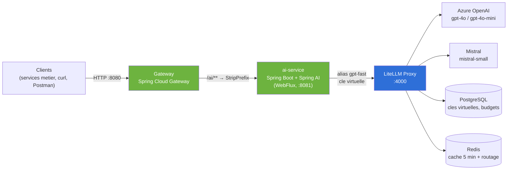
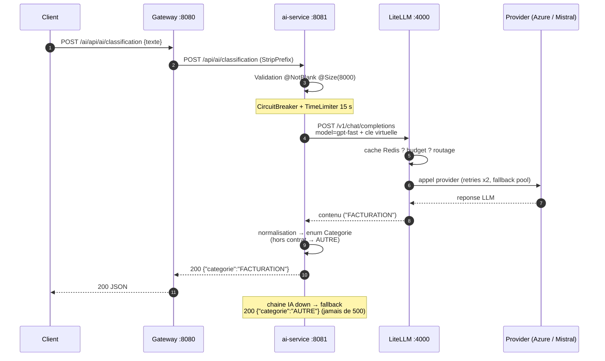
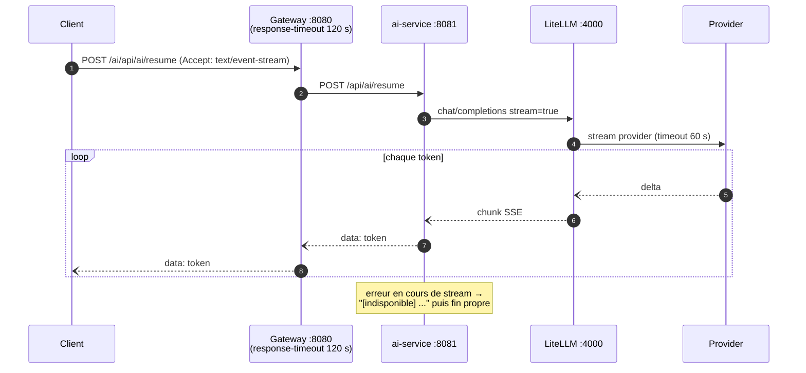

# Plateforme LLM — 100% Spring : Gateway + Spring AI + LiteLLM

Plateforme d'acces aux LLM pour services metier : les clients passent par une
Gateway Spring Cloud, le `ai-service` (Spring Boot + Spring AI) porte les
prompts, et LiteLLM centralise providers, cles, budgets, cache et fallbacks.

## Architecture



Principes :

- **Les services Java ne connaissent que des alias** (`gpt-fast`, `gpt-smart`) —
  changer de provider = modifier `litellm/litellm_config.yaml`, zero redeploiement.
- **Une cle virtuelle par service appelant** : suivi des couts et budget par equipe.
- **Retries uniquement dans LiteLLM** (`num_retries: 2`) — jamais cote Java
  (`spring.ai.retry.max-attempts: 1`), pas de double retry.
- **Resilience cote ai-service** : circuit breaker + time limiter (15 s) sur la
  classification, reponse degradee `AUTRE` si toute la chaine IA est down.

### Decoupage SOLID du ai-service

```
com.acme.ai
├── domain/                  # cœur metier, AUCUNE dependance technique
│   ├── Categorie            # enum contrat + normalisation de la sortie LLM
│   ├── ResumeService        # port (interface)
│   └── ClassificationService# port (interface)
├── llm/                     # adaptateurs Spring AI → LiteLLM (implementent les ports)
│   ├── ResumeAiService
│   └── ClassificationAiService
└── web/                     # adaptateur HTTP
    ├── AiController         # depend des ports, jamais de Spring AI
    ├── GlobalExceptionHandler  # erreurs uniformes {code, message, details}
    └── dto/                 # TexteRequete (validation), ClassificationReponse, ErreurReponse
```

Le sens des dependances est unique : `web → domain ← llm`. Remplacer Spring AI
(ou LiteLLM) ne touche que `llm/` ; changer le contrat HTTP ne touche que `web/`.

Toutes les erreurs de l'API sortent au meme format, sans fuite de detail interne :

```json
{ "code": "VALIDATION", "message": "Requete invalide.", "details": ["texte : ne doit pas etre vide"] }
```

## Flow d'appel

### Classification (synchrone, protegee)



### Resume (streaming SSE)



## Lancement one-shot (environnement inclus)

Un seul script fait **tout** : verifie Docker (l'**installe s'il est absent** —
winget sur Windows, get.docker.com sur Linux, Homebrew sur macOS), demarre le
daemon, cree le `.env` avec des secrets aleatoires, monte l'infra IA, genere la
cle virtuelle LiteLLM, build et demarre les services Spring, puis smoke test.

```powershell
# Windows (PowerShell)
.\start.ps1
```

```bash
# Linux / macOS / Git Bash
chmod +x start.sh && ./start.sh
```

> Sans cle provider dans le `.env`, la plateforme demarre et repond en **mode
> degrade** (`AUTRE` / `[indisponible]`). Pour de vraies reponses LLM :
> renseigner `AZURE_API_KEY`+`AZURE_API_BASE` ou `MISTRAL_API_KEY` dans le
> `.env` puis `docker compose up -d ai-service`.

| Composant  | URL locale                                      |
|------------|--------------------------------------------------|
| Gateway    | http://localhost:8080                            |
| ai-service | http://localhost:8081                            |
| LiteLLM UI | http://localhost:4000/ui (login : master key du `.env`) |

Tests manuels : importer `postman_collection.json` dans Postman et renseigner
la variable `litellm_master_key` depuis le `.env`.

## Lancement manuel, etape par etape

<details>
<summary>Deplier si vous preferez tout faire a la main</summary>

### 0. Prerequis

- Docker + Docker Compose (installes automatiquement par `start.ps1`/`start.sh`)
- Java 21 + Maven — uniquement pour le dev local hors conteneur
- Une cle API d'au moins un provider (Azure OpenAI ou Mistral)

### 1. Secrets

```bash
cp .env.example .env
# Remplir : LITELLM_MASTER_KEY, POSTGRES_PASSWORD, AZURE_* ou MISTRAL_API_KEY
# Premier boot : mettre la master key dans AI_SERVICE_VIRTUAL_KEY (remplacee a l'etape 3)
```

### 2. Demarrer l'infra IA seule et la verifier

```bash
docker compose up -d postgres redis litellm
curl http://localhost:4000/health/liveliness        # -> alive

# Test direct de l'alias gpt-fast :
curl http://localhost:4000/v1/chat/completions \
  -H "Authorization: Bearer $LITELLM_MASTER_KEY" \
  -H "Content-Type: application/json" \
  -d '{"model":"gpt-fast","messages":[{"role":"user","content":"Bonjour"}]}'
```

### 3. Creer la cle virtuelle du ai-service

```bash
curl -X POST http://localhost:4000/key/generate \
  -H "Authorization: Bearer $LITELLM_MASTER_KEY" \
  -H "Content-Type: application/json" \
  -d '{"key_alias":"ai-service","max_budget":0.001,"soft_budget":0.0009,"budget_duration":"30d"}'
# Copier la cle "sk-..." retournee dans AI_SERVICE_VIRTUAL_KEY du .env
```

Chaque service appelant recoit SA cle : suivi des couts et budget par equipe.

- `max_budget` **0.001 USD** : quota dur — au-dela, LiteLLM bloque la cle
  (erreur `ExceededBudget`, le ai-service repond alors en mode degrade).
- `soft_budget` **0.0009 USD** : seuil d'alerte — LiteLLM signale le
  depassement (webhook/Slack si l'alerting est configure) sans bloquer.
- Le compteur se remet a zero tous les `budget_duration` (30 jours).
- Suivi en direct : LiteLLM UI → Virtual Keys, ou `GET /key/info`.

> Valeurs volontairement minuscules pour DEMONTRER le blocage de quota des
> les premiers appels : en usage reel, ajuster aux couts de l'equipe.

### 4. Demarrer toute la plateforme

```bash
docker compose up -d --build
```

### 5. Tester la chaine complete

```bash
# Classification (synchrone, avec circuit breaker + reponse degradee)
curl -X POST http://localhost:8080/ai/api/ai/classification \
  -H "Content-Type: application/json" \
  -d '{"texte":"Ma facture de mars comporte une erreur de TVA"}'
# -> {"categorie":"FACTURATION"}

# Resume (streaming SSE via la gateway, timeout 120 s)
curl -N -X POST http://localhost:8080/ai/api/ai/resume \
  -H "Content-Type: application/json" \
  -H "Accept: text/event-stream" \
  -d '{"texte":"Commande 4512 : 3 pompes centrifuges, livraison Lyon..."}'
```

</details>

## Tests automatises

```bash
cd ai-service && mvn test
# ou sans JDK local :
docker run --rm -v "$PWD/ai-service:/build" -w /build maven:3.9-eclipse-temurin-21 mvn -B test
```

`AiControllerTest` remplace LiteLLM par WireMock (reponses OpenAI-compatibles
simulees, y compris SSE et pannes) : contrat, normalisation, validation et
degradation sont valides sans appeler de vrai LLM. `CategorieTest` couvre la
normalisation de la sortie LLM.

## Benchmark

```bash
# 1. Overhead infra pur : activer network_mock dans litellm_config.yaml
#    (litellm_settings: network_mock: true) puis :
k6 run scripts/k6-streaming.js

# 2. Surveiller en continu le header x-litellm-overhead-duration-ms
#    et la gauge Prometheus litellm_in_flight_requests.
```

Seuils du script : TTFT P95 < 1,5 s, erreurs < 1 %.

## Dev local rapide (hors Docker)

```bash
docker compose up -d postgres redis litellm
cd ai-service && mvn spring-boot:run   # avec spring-boot-devtools pour le hot-reload
```

## Arret / reinitialisation

```bash
docker compose down          # arret
docker compose down -v       # arret + suppression des donnees (Postgres)
```

## Utiliser ce projet comme fondation

Ce depot est concu comme une **base de depart** pour toute solution
« services metier + LLM ». Les conventions a respecter en l'etendant :

| Convention | Ou / comment |
|---|---|
| Un port (interface) par cas d'usage | `domain/` — aucune dependance technique |
| Prompts versionnes avec le code | `llm/` uniquement, classes package-private |
| Vocabulaire metier en entree, jamais de prompt | `web/` (contrat HTTP) |
| Entrees validees et bornees | Bean Validation sur les DTOs (`@NotBlank`, `@Size`) |
| Erreurs uniformes `{code, message, details}` | `GlobalExceptionHandler` — rien d'autre ne sort |
| Resilience a la frontiere | CircuitBreaker/TimeLimiter sur le controleur, fallback degrade |
| Retries dans LiteLLM seulement | `spring.ai.retry.max-attempts: 1`, `num_retries` dans litellm_config |
| Un `ChatClient` unique | `config/ChatClientConfig` — defaults/advisors en un seul endroit |
| Alias de modeles, jamais de provider | `litellm_config.yaml` (`gpt-fast`, `gpt-smart`) |

### Ajouter un cas d'usage IA en 4 etapes (ex. traduction)

```text
1. domain/  TraductionService.java          → interface : String traduire(String texte, String langue)
2. llm/     TraductionAiService.java        → @Service package-private, prompt + ChatClient injecte
3. web/     endpoint dans AiController (ou nouveau controleur) + DTO valide
4. test/    stub WireMock + assertions de contrat (voir AiControllerTest)
```

Aucun autre fichier a toucher : ni la gateway (route `/ai/**` deja en place),
ni docker-compose, ni LiteLLM (sauf nouvel alias de modele).

### Qualite continue

- **CI GitHub Actions** (`.github/workflows/ci.yml`) : tests ai-service,
  build gateway, build des images Docker a chaque push/PR.
- **`.editorconfig`** : conventions d'indentation/encodage partagees
  (attention : les `.ps1` restent en UTF-8 **avec BOM**).
- Tests sans vrai LLM (WireMock) : rapides, deterministes, gratuits.

## Aller plus loin

- **Keycloak / OIDC** : decommenter les blocs marques dans les deux `pom.xml`
  et les deux `application.yaml` (ai-service et Gateway).
- **Kubernetes** : LiteLLM en Deployment 2+ replicas derriere un Service
  ClusterIP (jamais d'Ingress) ; NetworkPolicy restreignant l'acces au seul
  ai-service ; secrets providers via Vault/Secret K8s dans le namespace infra IA.
- **Nouveaux modeles** : ajouter une entree dans `litellm_config.yaml` — aucun
  changement Java.

## Versions

Les versions (Spring Boot 3.4.x, Spring AI 1.0.x, Spring Cloud 2024.0.x,
Resilience4j 2.2.x) sont des reperes au moment de la generation : verifier
les dernieres versions stables avant un passage en production.
